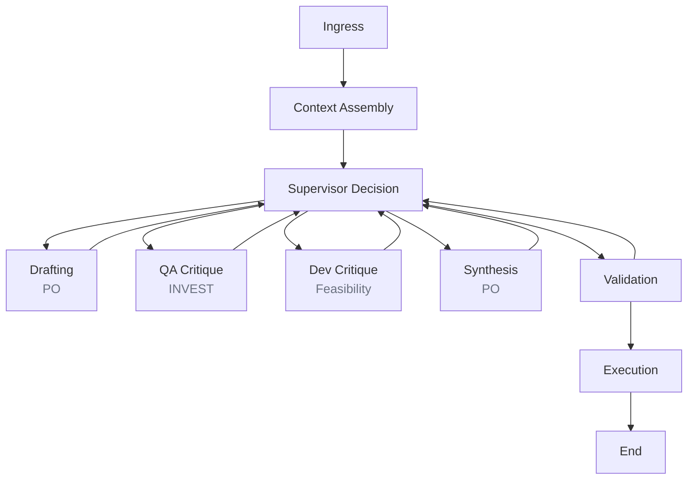
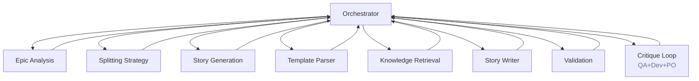
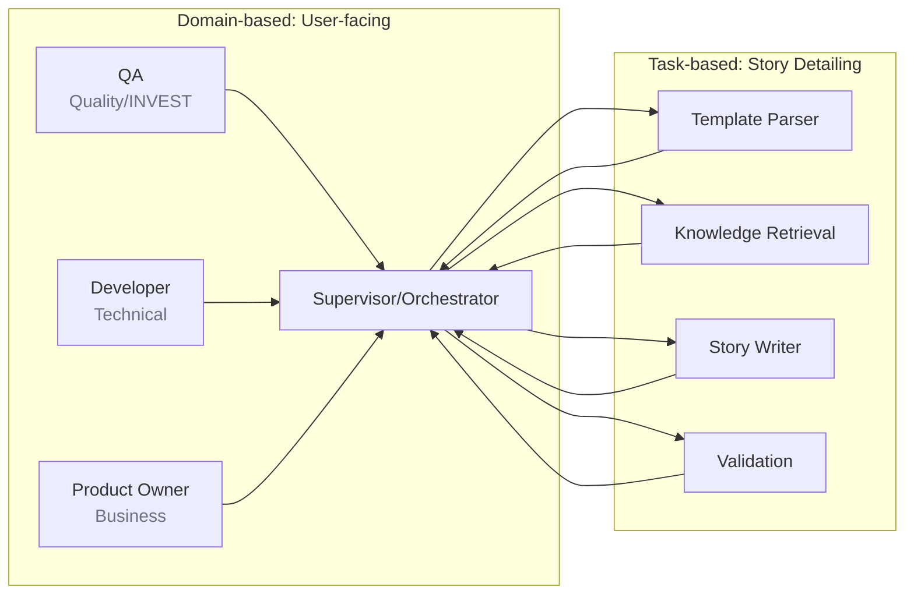
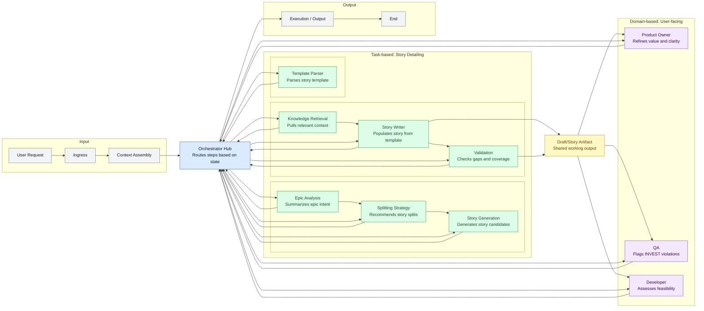

# Synapse Agentic AI Architecture (1-page)

## What this system is
Synapse is an agentic AI system that orchestrates multiple specialist agents to generate, critique, and refine Agile artifacts. It is not just RAG or a single-agent chatbot; it uses a supervisor-driven, multi-agent loop with stateful memory and iterative feedback until quality criteria are met.

## How it maps to the attached diagram
- **Agentic RAG**: The workflow combines retrieval with multi-agent planning and critique.
- **Aggregator/Orchestrator Agent**: `SupervisorAgent` and `OrchestratorAgent` decide next actions and route work.
- **Specialist Agents**: Product Owner, QA, and Developer agents collaborate with critique and synthesis.
- **Memory**: Structured state + critique history + vector store for long-term knowledge.
- **Tools/Data sources**: Issue tracker and knowledge base adapters act as tool-like integrations.

## End-to-end flow (simplified)
1. **Ingress**: Input request enters the cognitive graph.
2. **Context Assembly**: Retrieve relevant knowledge from the vector store.
3. **Drafting**: Product Owner agent drafts an artifact.
4. **Critique Loop**:
   - QA agent checks INVEST quality.
   - Developer agent checks feasibility/risks.
   - PO agent synthesizes and refines.
5. **Validation**: Confidence scoring and violation checks.
6. **Execution**: Update downstream systems (e.g., issue tracker).

## Diagram: Cognitive agentic workflow (as implemented)

## Diagram: Story generation workflow and mapping
This maps the story-writing flow to the agentic loop (orchestrator = supervisor role).

**Mapping to the agentic loop**
- **Supervisor/Planner**: `OrchestratorAgent` decides next step.
- **Drafting**: `StoryWriterAgent` produces the populated story.
- **Critique Loop**: `QAAgent` + `DeveloperAgent` + `ProductOwnerAgent` refine.
- **Validation**: `ValidationGapDetectionAgent` checks gaps.
- **Retrieval/Context**: `KnowledgeRetrievalAgent` pulls evidence for grounding.

## Domain-based vs task-based agent mapping
The system uses both domain-based agents (user-facing roles) and task-based specialists:

- **User-facing categories remain domain-based**: Business/Technical/Orchestrator with PO/QA/Dev critique.
- **Story detailing is task-based**: template parsing, retrieval, writing, and validation are handled by specialist agents.
- **Result**: This is not a full shift to task-based agents; both models are present and coordinated.

**How the two models map in practice**

## Unified diagram (single view)
This single diagram shows the agentic workflow, story generation flow, and how domain-based and task-based agents map together.
All agent interactions are mediated by the Orchestrator via shared state; agents do not call each other directly. The orchestrator chooses the next step based on state, so the sequence is conditional. The numbered arrows below show a typical happy-path sequence.

Yes, an n8n-style diagram can help for presentations. If you want it, I can generate a visual flowchart (PNG/SVG) using this unified layout.

## Core components and responsibilities
- **Supervisor + LangGraph routing**: Dynamic decision-making across steps.
- **Multi-agent debate pattern**: QA + Dev critique, PO synthesizes.
- **Stateful memory**: Debate history and confidence tracking per iteration.
- **Retrieval**: LanceDB-backed retrieval provides evidence and context.
- **Adapters**: Clean integration points for LLMs, issue trackers, and knowledge stores.

## Hybrid RAG + Context Graph (GraphRAG-lite)
This is the recommended MVP approach: keep vector retrieval as the primary signal and
build a lightweight Context Graph per workflow run for provenance and multi-hop links.

### How to start implementation
1) **Define the context graph schema** in the domain layer (nodes, edges, snapshot).
2) **Add a graph store port** (Protocol) and in-memory adapter for MVP.
3) **Extend retrieval** to emit graph nodes/edges alongside retrieved chunks.
4) **Attach a snapshot** to the story artifact so UI can render citations/evidence.

### Where to start in this repo
- **Domain models**: `src/domain/schema.py` (add ContextGraphNode/Edge/Snapshot).
- **Ports**: `src/domain/interfaces.py` (graph store + graph builder protocols).
- **Retrieval**: `src/ingestion/vector_db.py` (return chunk metadata + IDs).
- **Workflow state**: `src/cognitive_engine/story_state.py` (store graph snapshot).
- **Story output**: `src/cognitive_engine/story_nodes.py` (attach citations).
- **Memory store**: `src/infrastructure/memory/in_memory_store.py` (MVP graph cache).

### Jira + Confluence integration difficulty
Moderate. The API surfaces are well-documented, but the complexity is in:
- OAuth/Token handling, scopes, and tenant configuration (especially Atlassian Cloud).
- Rate limits and pagination for large spaces/projects.
- Content parsing for Confluence (rich text + attachments).
You can model both as ingestion adapters using the same patterns as existing ingress/egress
adapters, but plan for 1–2 sprints if you need robust coverage and governance.

## Why this qualifies as Agentic AI (vs RAG)
- **Planning and routing**: Supervisor selects the next action based on state.
- **Multiple agents**: Distinct roles with separate critiques.
- **Feedback loops**: Iterative refinement with convergence criteria.
- **Memory + retrieval**: Persistent context across iterations.

## Key files for reference
- Orchestration graph: `src/cognitive_engine/graph.py`
- Supervisor routing: `src/cognitive_engine/agents/supervisor.py`
- Critique loop: `src/cognitive_engine/story_nodes.py`
- State + memory: `src/cognitive_engine/story_state.py`, `src/infrastructure/memory/`
- Retrieval: `src/ingestion/vector_db.py`

---
Note: The attached image is referenced via a local absolute path. If you plan to share or commit this document, move the image into the repo (e.g., `docs/assets/`) and update the link.
