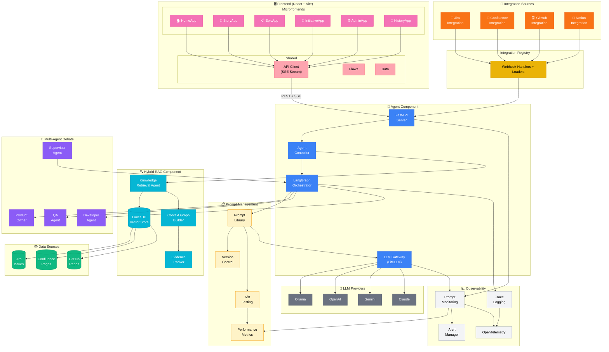

# Synapse Architecture Diagram

## Mermaid Diagram (Renderable)

Copy this into any Mermaid renderer (GitHub, Notion, mermaid.live, etc.):



---

## Component Breakdown

### Layer 0: Frontend (Pink)
| Component | Purpose |
|-----------|---------|
| HomeApp | Landing page, navigation |
| StoryApp | Story detailing workflow UI |
| EpicApp | Epic splitting workflow UI |
| InitiativeApp | Initiative breakdown workflow UI |
| AdminApp | Integration settings, templates |
| HistoryApp | View past workflow runs |
| API Client | REST + SSE streaming to backend |

### Layer 1: Integration Sources (Orange)
| Component | Purpose |
|-----------|---------|
| Jira Integration | Load issues, sync stories |
| Confluence Integration | Load documentation pages |
| GitHub Integration | Load code, PRs, issues |
| Notion Integration | Load knowledge pages |

### Layer 2: Agent Component (Blue)
| Component | Purpose |
|-----------|---------|
| FastAPI Server | REST API endpoints |
| Agent Controller | Request routing |
| LangGraph Orchestrator | Workflow state machine |
| LLM Gateway (LiteLLM) | Multi-provider LLM access |

### Layer 3: Prompt Management (Amber) - NEW
| Component | Purpose |
|-----------|---------|
| Prompt Library | Centralized prompt template storage |
| Version Control | Prompt versioning and rollback |
| A/B Testing | Prompt variant testing |
| Performance Metrics | Track prompt effectiveness |

### Layer 4: Hybrid RAG Component (Cyan)
| Component | Purpose |
|-----------|---------|
| Knowledge Retrieval Agent | Intent extraction + search |
| LanceDB Vector Store | Embeddings + metadata |
| Context Graph Builder | Build evidence graph |
| Evidence Tracker | Track citations |

### Layer 5: Multi-Agent Debate (Purple)
| Component | Purpose |
|-----------|---------|
| Product Owner Agent | Business value, clarity |
| QA Agent | INVEST validation |
| Developer Agent | Technical feasibility |
| Supervisor Agent | Routing decisions |

### Layer 6: Observability (Gray)
| Component | Purpose |
|-----------|---------|
| Prompt Monitoring | Track LLM calls, tokens, cost |
| Alert Manager | Threshold-based alerting |
| Trace Logging | Structured logs |
| OpenTelemetry | Distributed tracing export |

---

## Draw.io / Excalidraw Template

To create a visual diagram like the reference image:

### Color Palette
```
Frontend:            #ec4899 (Pink)
Microfrontends:      #f472b6 (Light Pink)
Shared:              #fda4af (Rose)
Integration Sources: #f97316 (Orange)
Registry:            #eab308 (Yellow)
Agent Component:     #3b82f6 (Blue)
Prompt Management:   #fef3c7 (Amber) - NEW
Hybrid RAG:          #06b6d4 (Cyan)
Multi-Agent:         #8b5cf6 (Purple)
LLM Providers:       #6b7280 (Gray)
Data Sources:        #10b981 (Green)
Observability:       #f3f4f6 (Light Gray)
```

### Box Layout (Top to Bottom, Left to Right)

```
┌─────────────────────────────────────────────────────────────────────────────┐
│                         SYNAPSE: AGENTIC STORY WRITER                       │
├─────────────────────────────────────────────────────────────────────────────┤
│                                                                             │
│  ┌─────────────────────────────────────────────────────────────────────┐   │
│  │ FRONTEND - React + Vite (Pink)                                       │   │
│  │  ┌─────────────────────────────────────────┐ ┌───────────────────┐  │   │
│  │  │ Microfrontends                          │ │ Shared            │  │   │
│  │  │  ┌───────┐┌───────┐┌───────┐┌────────┐ │ │ ┌───────────────┐ │  │   │
│  │  │  │ Home  ││ Story ││ Epic  ││Initiat.│ │ │ │ API Client    │ │  │   │
│  │  │  │ App   ││ App   ││ App   ││  App   │ │ │ │ (SSE Stream)  │ │  │   │
│  │  │  └───────┘└───────┘└───────┘└────────┘ │ │ ├───────────────┤ │  │   │
│  │  │  ┌─────────┐ ┌─────────┐               │ │ │ Flows + Data  │ │  │   │
│  │  │  │ Admin   │ │ History │               │ │ └───────┬───────┘ │  │   │
│  │  │  │ App     │ │ App     │               │ │         │         │  │   │
│  │  │  └─────────┘ └─────────┘               │ └─────────┼─────────┘  │   │
│  │  └────────────────────────────────────────┘           │            │   │
│  └───────────────────────────────────────────────────────┼────────────┘   │
│                                                          │                 │
│                                             REST + SSE   │                 │
│                                                          ▼                 │
│  ┌─────────────────────────────────────────────────────────────────────┐   │
│  │ INTEGRATION SOURCES (Orange)                                         │   │
│  │  ┌─────────┐ ┌─────────┐ ┌─────────┐ ┌─────────┐                    │   │
│  │  │  Jira   │ │Confluenc│ │ GitHub  │ │ Notion  │                    │   │
│  │  └────┬────┘ └────┬────┘ └────┬────┘ └────┬────┘                    │   │
│  └───────┼──────────┼──────────┼──────────┼────────────────────────────┘   │
│          └──────────┴─────┬────┴──────────┘                                 │
│                           ▼                                                 │
│  ┌─────────────────────────────────────────┐   ┌───────────────────────┐   │
│  │ INTEGRATION REGISTRY (Yellow)           │   │ OBSERVABILITY (Gray)  │   │
│  │  Webhook Handlers + Loaders             │   │  ┌─────────────────┐  │   │
│  └─────────────────────┬───────────────────┘   │  │ Prompt Monitor  │  │   │
│                        ▼                        │  ├─────────────────┤  │   │
│  ┌─────────────────────────────────────────┐   │  │ Alert Manager   │  │   │
│  │ AGENT COMPONENT (Blue)                  │   │  ├─────────────────┤  │   │
│  │  ┌───────────┐  ┌───────────────────┐   │   │  │ Trace Logging   │  │   │
│  │  │LLM Gateway│  │Agent Controller   │   │   │  ├─────────────────┤  │   │
│  │  │ (LiteLLM) │  └─────────┬─────────┘   │   │  │ OpenTelemetry   │  │   │
│  │  └─────┬─────┘            │             │   │  └─────────────────┘  │   │
│  │        │      ┌───────────▼─────────┐   │   └───────────────────────┘   │
│  │        │      │LangGraph Orchestrator│   │                               │
│  │        │      └───────────┬─────────┘   │   ┌───────────────────────┐   │
│  │        │                  │             │   │ PROMPT MGMT (Amber)   │   │
│  │  ┌─────▼─────┐  ┌─────────▼─────────┐   │   │  ┌─────────────────┐  │   │
│  │  │FastAPI    │◄─┤  Handlers         │   │   │  │ Prompt Library  │  │   │
│  │  │Server     │  │  (Story/Optimize) │   │   │  ├─────────────────┤  │   │
│  │  └───────────┘  └───────────────────┘   │   │  │ Version Control │  │   │
│  └─────────────────────┬───────────────────┘   │  ├─────────────────┤  │   │
│                        │                        │  │ A/B Testing     │  │   │
│     ┌──────────────────┼──────────────────┐    │  ├─────────────────┤  │   │
│     ▼                  ▼                  ▼    │  │ Perf Metrics    │  │   │
│  ┌─────────────────────────────────────────┐   │  └─────────────────┘  │   │
│  │ MULTI-AGENT DEBATE (Purple)             │   └───────────────────────┘   │
│  │  ┌─────────┐ ┌─────────┐ ┌─────────┐   │   ┌───────────────────────┐   │
│  │  │Product  │ │  QA     │ │Developer│   │   │ HYBRID RAG (Cyan)     │   │
│  │  │Owner    │ │ Agent   │ │ Agent   │   │   │  ┌─────────────────┐  │   │
│  │  └────┬────┘ └────┬────┘ └────┬────┘   │   │  │Knowledge        │  │   │
│  │       └───────────┼───────────┘        │   │  │Retrieval Agent  │  │   │
│  │                   ▼                    │   │  └────────┬────────┘  │   │
│  │            ┌─────────────┐             │   │           │           │   │
│  │            │ Supervisor  │             │   │  ┌────────▼────────┐  │   │
│  │            │   Agent     │             │   │  │    LanceDB      │  │   │
│  │            └─────────────┘             │   │  │  Vector Store   │  │   │
│  └─────────────────────────────────────────┘   │  └────────┬────────┘  │   │
│                                                │           │           │   │
│  ┌─────────────────────────────────────────┐   │  ┌────────▼────────┐  │   │
│  │ LLM PROVIDERS (Gray)                    │   │  │ Context Graph   │  │   │
│  │  ┌───────┐ ┌───────┐ ┌───────┐ ┌─────┐ │   │  │   Builder       │  │   │
│  │  │Ollama │ │OpenAI │ │Gemini │ │Claude│ │   │  └────────┬────────┘  │   │
│  │  └───────┘ └───────┘ └───────┘ └─────┘ │   │           │           │   │
│  └─────────────────────────────────────────┘   │  ┌────────▼────────┐  │   │
│                                                │  │Evidence Tracker │  │   │
│                                                │  └─────────────────┘  │   │
│                                                └───────────────────────┘   │
│                                                                             │
│  ┌─────────────────────────────────────────────────────────────────────┐   │
│  │ DATA SOURCES (Green)                                                 │   │
│  │  ┌─────────────┐ ┌─────────────┐ ┌─────────────┐                    │   │
│  │  │ Jira Issues │ │ Confluence  │ │ GitHub Repos│                    │   │
│  │  │     DB      │ │   Pages     │ │   + Code    │                    │   │
│  │  └─────────────┘ └─────────────┘ └─────────────┘                    │   │
│  └─────────────────────────────────────────────────────────────────────┘   │
│                                                                             │
└─────────────────────────────────────────────────────────────────────────────┘
```

---

## Quick Render Options

1. **Mermaid Live Editor**: https://mermaid.live - Paste the mermaid code above
2. **GitHub**: Just include the mermaid block in a `.md` file
3. **Notion**: Use `/mermaid` block
4. **Excalidraw**: Create boxes manually with the color palette
5. **draw.io**: Import as template and customize

---

## Export to Image

To export the Mermaid diagram as PNG/SVG:
1. Go to https://mermaid.live
2. Paste the code
3. Click "Download PNG" or "Download SVG"
